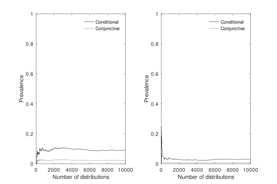

# A New Condition for Agglomeration in Bayesian Confirmation

Bayesian confirmation does not generally agglomerate over conjunction. That is, whenever a piece of evidence $E$ confirms two hypotheses $H_1$ and $H_2$ *individually*, it does not follow that $E$ also confirms them *conjunctively*. Or more formally, condition 1 below does not entail condition 2:

1. $P(H_1|E)>P(H_1)$ and $P(H_2|E)>P(H_2)$

2. $P(H_1\land H_2|E)>P(H_1\land H_2)$

However, if the following new condition is satisfied, condition 1 *does* entail condition 2:

3. $P(\neg H_1\land \neg H_2|E)>P(\neg H_1\land \neg H_2)$

I call condition 3 *NOR-confirmation*. To see how peculiar this new result is, imagine the following dialogue:

> Researcher: Mr. Jones, good to see you! I just received your lab results. I have some good and some bad news for you. The bad news is that the results confirm that you have viral pneumonia; and they also confirm that you have bacterial pneumonia.
>
> Jones: Oh dear! So I have both viral and bacterial pneumonia?! That explains why I feel so miserable!
>
> Researcher: Well, that is not quite what I said, Mr. Jones! In any case, the good news is that the results also confirm that you have neither viral nor bacterial pneumonia.
>
> Jones: Wait, didn’t you just tell me the opposite? Do the results confirm that I have viral and bacterial pneumonia or do they confirm that I don’t?!
>
> Researcher: Well, they confirm both, Mr. Jones, albeit in different ways.
>
> Jones: How can this be? Is there something wrong with the lab results?
>
> Researcher: No, I can assure you that our lab results are flawless and absolutely reliable. In fact, it follows that they also confirm that you have viral and bacterial pneumonia at the same time.

The researcher’s utterances sound confusing her inference seems invalid. But the researcher’s inference is valid and everything she says is consistent.

This repo provides the code for the numerical results involving the new NOR-confirmation condition.

The results are published in Philosophy of Science:

- https://www.cambridge.org/core/journals/philosophy-of-science/article/new-condition-for-agglomeration-in-bayesian-confirmation/BF3906892462EEE562594F1F2713C119

A penultimate version of the paper can be found here:

- https://github.com/jottemka/agglomeration_condition/blob/main/agglomeration_ps.pdf

## Results



Two types of prevalence values for NOR-confirmation are calculated:

1. *Conjunctive Prevalence*: proportion of probability functions satisfying conditions 1 *and* 3 and thus 2.

2. *Conditional Prevalence*: proportion of probability functions satisfying conditions 3 *if* they satisfy 1.

These results are shown on the left-hand side of the plot. For comparison, the corresponding values for Simpson's paradox are shown on the right-hand side. The precise values are shown below:

<table id="T_74a50">
  <thead>
    <tr>
      <th id="T_74a50_level0_col0" class="col_heading level0 col0" >Effect</th>
      <th id="T_74a50_level0_col1" class="col_heading level0 col1" >Conjunctive Prevalence</th>
      <th id="T_74a50_level0_col2" class="col_heading level0 col2" >Conditional Prevalence</th>
    </tr>
  </thead>
  <tbody>
    <tr>
      <td id="T_74a50_row0_col0" class="data row0 col0" >NOR-confirmation Effect</td>
      <td id="T_74a50_row0_col1" class="data row0 col1" >0.025101</td>
      <td id="T_74a50_row0_col2" class="data row0 col2" >0.100429</td>
    </tr>
    <tr>
      <td id="T_74a50_row2_col0" class="data row2 col0" >Simpson's Paradox</td>
      <td id="T_74a50_row2_col1" class="data row2 col1" >0.008324</td>
      <td id="T_74a50_row2_col2" class="data row2 col2" >0.033288</td>
    </tr>
  </tbody>
</table>

## Further Reading

1. http://fitelson.org/confirmation/carnap_logical_foundations_of_probability.pdf

1. https://conservancy.umn.edu/server/api/core/bitstreams/659aa39b-5cd4-46d3-8f9a-94e97fafe464/content

1. https://www.tandfonline.com/doi/abs/10.1080/01621459.1972.10482387

1. https://www.cambridge.org/core/journals/philosophy-of-science/article/abs/how-to-confirm-the-conjunction-of-disconfirmed-hypotheses/45E5ECA1BA4293F465BEC18677CBD4BC

## Virtual Environment Setup

Use the requirements file to create a new environment for this task. 

```Bash
pyenv local 3.11.3
python -m venv .venv
source .venv/bin/activate
pip install --upgrade pip
pip install -r requirements.txt
```

### **`WindowsOS`** type the following commands :

Install the virtual environment and the required packages by following commands.

For `PowerShell` CLI :

```PowerShell
python -m venv .venv
.venv\Scripts\Activate.ps1
pip install --upgrade pip
pip install -r requirements.txt
```

For `Git-Bash` CLI:

```
python -m venv .venv
source .venv/Scripts/activate
pip install --upgrade pip
pip install -r requirements.txt
```
